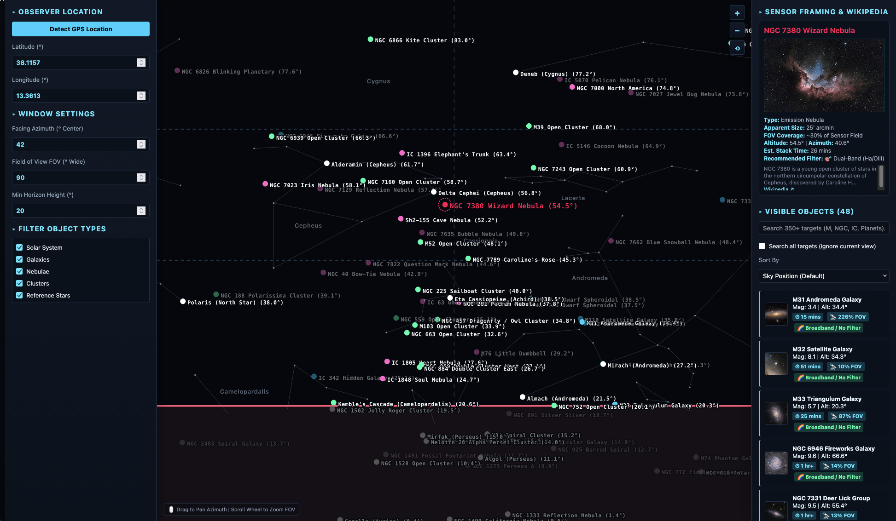

Deep Sky Spot
-------------

A simple standalone app for finding deep sky objects (nebulae, galaxies, clusters, planets...) visible from a position on Earth, through a given window or opening in the sky.

This is particularly useful when wanting to observe deep sky objects from an apartment with only windows to watch the sky!

[Open the app](https://k4rm.github.io/deep_sky_spot/app.html)

## Features

- Set your position on Earth (manually, or via "Detect GPS Location"), a facing azimuth, a minimum horizon altitude, and a field of view to define exactly which slice of the sky is observable from where you're standing.
- Real-time sky map of 200+ objects: the full solar system (Sun, Moon, planets) plus galaxies, nebulae, and star clusters, all with live altitude/azimuth.
- Background constellation overlay: stick figures, IAU names, and faint stars, layered behind the targets.
- Search the visible-object list, and sort it by sky position, FOV coverage, or estimated stack time.
- Per-target FOV coverage %, estimated stacking/exposure time, and a recommended filter (dual-band Ha/OIII for emission-type nebulae, broadband/no filter otherwise).
- Preview image and summary for each object, pulled live from Wikipedia, with a link to the full article.
- Filter by object type: solar system, galaxies, nebulae, clusters, reference stars.
- Touch-friendly on mobile and iPad: drag to pan the view, pinch to zoom the field of view, and slide-in panels for settings and the object list.
- Deep-link straight to an object: append it to the app URL and the view pans and selects it automatically, e.g. [`app.html?Venus`](https://k4rm.github.io/deep_sky_spot/app.html?Venus) or [`app.html?M51`](https://k4rm.github.io/deep_sky_spot/app.html?M51) (a `#hash`, or a `?dso=`/`?target=` query param, also work). Matches by catalog ID or object name.

## Running it

It's a single static HTML file with no build step and no backend - open `app.html` directly in a browser, or use the [hosted version](https://k4rm.github.io/deep_sky_spot/app.html).

## Data sources

- Object previews and summaries: the [Wikipedia REST API](https://en.wikipedia.org/api/rest_v1/).
- Constellation lines and names: [d3-celestial](https://github.com/ofrohn/d3-celestial).

Enjoy!
